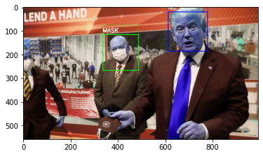
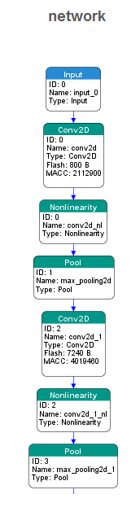

## Face-Mask-Detector for embedded platform and low cost systems

#covid19
#stm32
#ai

In this project, a Keras model for face mask detection is developed.
We use a pruned model and then the project runs on a Nucleo Development board(F746ZG).

This is a sample output of the code that run on PC "Mask Detection.ipynb" and "eval_FM.ipynb":

source image : https://s.abcnews.com/images/Politics/trump-michigan-15-rtr-jc-200521_hpMain_16x9_992.jpg

after importing "my_model_f.h5" model to embedded platform we have some difference in the output. 

P image : sample images that **have mask**

N image : sample images that **have not mask**

The output of system on **PC**:

network output for N11 
result for N11.bmp is without_mask 

network output for N12 
result for N12.bmp is without_mask 

network output for N13 
result for N13.bmp is without_mask 

network output for N14 
result for N14.bmp is without_mask 

network output for P11 
result for P11.bmp is with_mask 

network output for P12 
result for P12.bmp is with_mask 

network output for P13 
result for P13.bmp is with_mask 

network output for P14 
result for P14.bmp is with_mask 

| image        | probability of no mask in image           | probability of mask detection  |
| ------------- |:-------------:| -----:|
| P11 |0.9862385  | 0.01376154|
| N11 |2.6498967e-06 | 9.9999738e-01|
| P12 |0.9984925  | 0.00150748|
| N12 |9.114358e-04|  9.990885e-01
| P13 |0.9965546  | 0.00344538|
| N13 |0.03975931 | 0.9602407 |
| P14 |9.999670e-01 | 3.304353e-05|
| N14 |0.01601863 | 0.9839813 |

The output of system on **Nucleo board**:

| image        | probability of no mask in image           | probability of mask detection  |
| ------------- |:-------------:| -----:|
| P11 |  0.000309| 0.999691 |
| N11 | 0.999966 | 0.000034 |
| P12 | 0.000158 | 0.999842 |
| N12 | 0.000334 | 0.999666 |
| P13 | 0.000334 | 0.999665 |
| N13 | 0.999966 | 0.000034 |
| P14 | 0.000158 | 0.999842 |
| N14 | 0.000308 | 0.999692 |

# stm32 AI diagram

## Datasets and Reference

[The main source code for reference and datasets](https://github.com/anushkarjain/Face-Mask-Detector)

## Application

such a model can use in the street and with a red or green led signal to the pedestrian based on face mask status.
for completion, it needs a face detection model that runs on board before mask detection. Now the face detection is not developed on board.

these models could be used with an attendance system for face mask detection.

## Extra output 

model file         : my_model_f.h5

type               : keras (keras_dump) - tf.keras 2.4.0

c_name             : network

compression        : 4

quantize           : None

model_name         : my_model_f

input              : input_0 [10000 items, 39.06 KiB, ai_float, FLOAT32, (100, 100, 1)]

inputs (total)     : 39.06 KiB

output             : dense_1_nl [2 items, 8 B, ai_float, FLOAT32, (1, 1, 2)]

outputs (total)    : 8 B

params #           : 107,872 items (421.38 KiB)

macc               : 6,238,250

weights (ro)       : 115,112 B (112.41 KiB) (-73.32%) 

activations (rw)   : 207,760 B (202.89 KiB) 

ram (total)        : 247,768 B (241.96 KiB) = 207,760 + 40,000 + 8

my_model_f p=107872(421.38 KBytes) macc=6238250 rom=112.41 KBytes (-73.32%) ram=202.89 KiB io_ram=39.07 KiB
